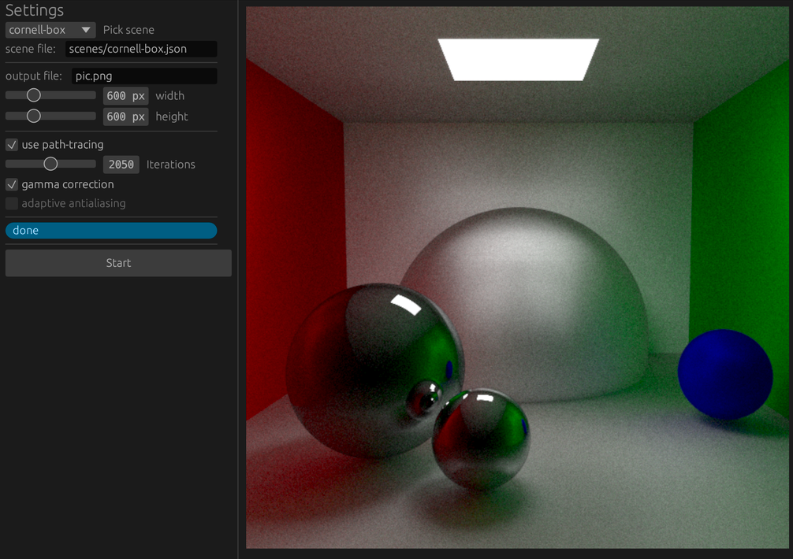

### RAYFLEX

Rust implementation of a ray-tracer and path-tracer.

Features:
 - ray-tracing + path-tracing
 - parallelism with rayon
 - allow the use of OBJ mesh objects
 - material: kd/ke/ks
 - light sources
 - antialiasing
 - bugs!

It can run with a user-interface (egui), or via command line interface.

## Scenes
Scenes are described in a json file that contains:
 - the position, direction and field-of-view of the camera
 - the definition of the light sources
 - the definition of each material kd/ke/ks used throughout the scene
 - the position of each infinite-plane, sphere or triangle if any
 - a pointer to a 3D mesh object stored in OBJ format
 - the resolution of the resulting picture

## Screenshots

